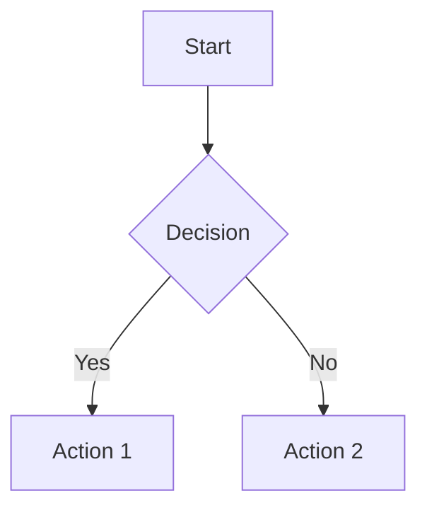
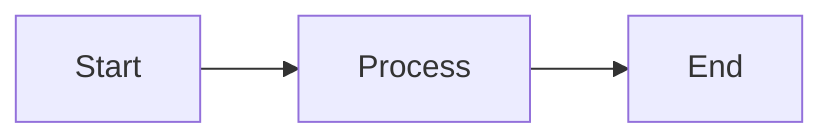
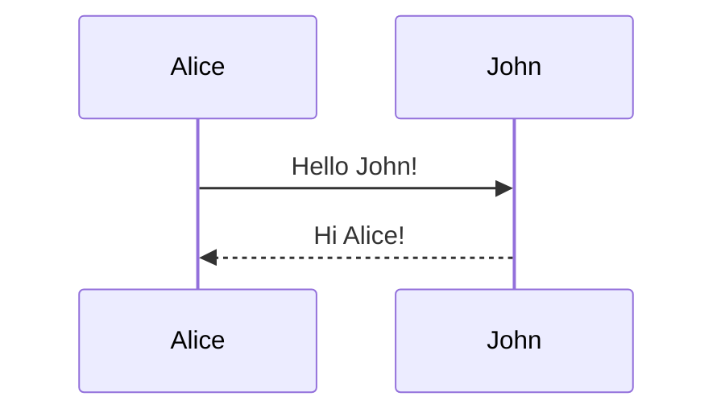
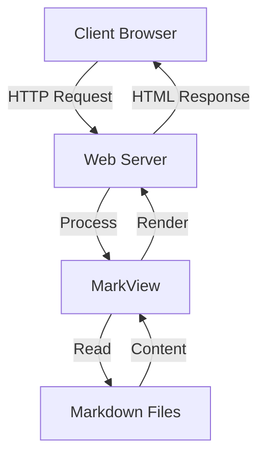
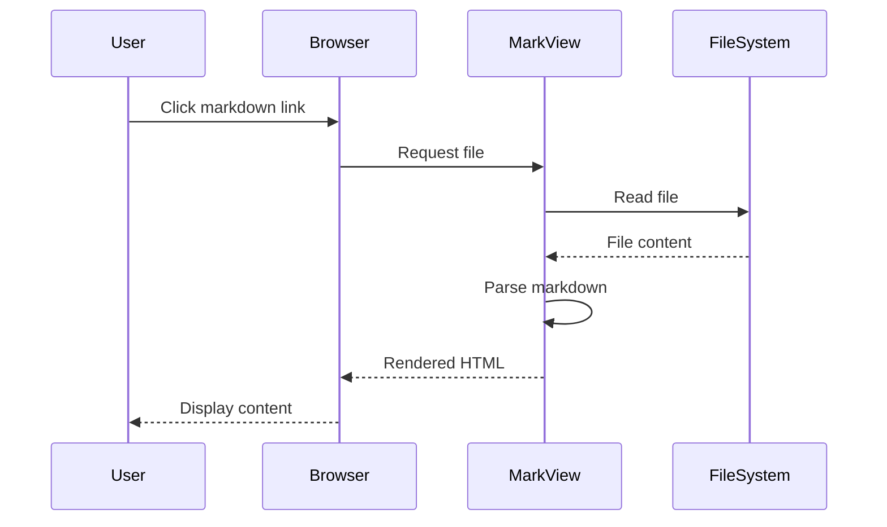

# MarkView

A feature-rich, standalone PHP-based markdown viewer with advanced document management capabilities. MarkView provides a comprehensive solution for viewing, navigating, and managing markdown documentation with a modern, responsive interface.

## Table of Contents

- [Features Overview](#features-overview)
- [Requirements](#requirements)
- [Quick Start](#quick-start)
- [Core Features](#core-features)
- [Advanced Features](#advanced-features)
- [Keyboard Shortcuts](#keyboard-shortcuts)
- [Usage Guide](#usage-guide)
- [Supported Markdown Syntax](#supported-markdown-syntax)
- [Security](#security)
- [Project Structure](#project-structure)
- [Examples](#examples)
- [License](#license)

## Features Overview

### Core Capabilities

- **Pure PHP Implementation**: No external dependencies required - single file application
- **Advanced File Browser**: Hierarchical navigation with search and filtering
- **Full Markdown Support**: Complete markdown rendering with GitHub-flavored markdown extensions
- **Syntax Highlighting**: Code blocks with language-specific syntax highlighting via Highlight.js
- **Diagram Rendering**: Support for Mermaid diagrams including flowcharts, sequence diagrams, and more
- **Responsive Design**: Mobile-friendly interface built with Tailwind CSS
- **Dark Mode**: System-aware dark mode with manual toggle
- **Print Optimization**: Print-friendly styling with proper page breaks and formatting

### Advanced Features

- **Customizable Themes**: Six built-in themes (Default, Dark, Sepia, Forest, Ocean, Sunset)
- **Bookmarking System**: Save and manage frequently accessed documents
- **Presentation Mode**: Fullscreen slide-based presentation from markdown content
- **File Comparison**: Side-by-side diff view for comparing two markdown files
- **Line Numbering**: Toggle line numbers in code blocks for easy reference
- **Table of Contents**: Auto-generated TOC with smooth scrolling navigation
- **File History**: Track recently viewed files with localStorage persistence
- **Export to HTML**: Download standalone HTML versions of markdown files
- **Search Functionality**: Full-text search across all markdown files with match highlighting
- **Content Search**: In-document search with jump-to-match navigation

## Requirements

- PHP 7.0 or higher
- Web server (Apache, Nginx) or PHP's built-in development server
- Modern web browser with JavaScript enabled
- No database required
- No additional PHP extensions needed

## Quick Start

### Using PHP Built-in Server

1. Navigate to the project directory:
```bash
cd /path/to/markview
```

2. Start the PHP development server:
```bash
php -S localhost:8000
```

3. Open your browser and visit:
```
http://localhost:8000
```

### Using Apache/Nginx

1. Copy the project files to your web server's document root
2. Ensure `index.php` has read permissions
3. Access through your browser:
```
http://yourdomain.com/markview/
```

4. The viewer will automatically load the first markdown file found or `README.md` if present

## Core Features

### 1. File Browser

**Overview**: A hierarchical file navigation system that displays all markdown files in your directory structure.

**Features**:
- Automatic discovery of all `.md` files in the project directory
- Collapsible directory tree structure
- Symbolic link support for external documentation
- Visual indicators for current file
- File count display
- Infinite symlink loop protection

**Usage**:
- Click any file in the sidebar to load it
- Files are organized by directory structure
- Symlinked directories are followed automatically

### 2. Markdown Rendering

**Overview**: Full-featured markdown parser with GitHub-flavored markdown support.

**Capabilities**:
- Headers (H1-H6) with automatic anchor IDs
- Text formatting (bold, italic, strikethrough)
- Code blocks with syntax highlighting
- Tables with alignment support
- Lists (ordered, unordered, nested)
- Blockquotes
- Horizontal rules
- Links (internal and external)
- Images with alt text
- Task lists with checkboxes

**Processing**:
- Server-side PHP parsing for core markdown
- Client-side enhancement for code highlighting
- Automatic link rewriting for internal navigation
- Image path resolution

### 3. Syntax Highlighting

**Overview**: Language-specific syntax highlighting for code blocks using Highlight.js.

**Supported Languages**:
- PHP, JavaScript, Python, Java, C/C++, C#
- Ruby, Go, Rust, Swift, Kotlin
- HTML, CSS, SCSS, SQL
- Bash/Shell, PowerShell
- JSON, XML, YAML
- Markdown, Diff
- And 180+ more languages

**Features**:
- Automatic language detection
- Multiple color themes
- Line numbering toggle
- Code block copy functionality

### 4. Diagram Support

**Overview**: Mermaid.js integration for rendering diagrams directly from markdown.

**Diagram Types**:
- Flowcharts
- Sequence diagrams
- Class diagrams
- State diagrams
- Entity-relationship diagrams
- Gantt charts
- Pie charts
- Git graphs

**Usage**:
```markdown

```

### 5. Search System

**Two-Level Search**:

**Global Search**:
- Search across all markdown files in the project
- Case-insensitive matching
- Results grouped by file
- Match count per file
- Line number references
- Context preview with highlighting
- Maximum 5 matches per file displayed

**Content Search**:
- Search within currently displayed document
- Real-time highlighting of matches
- Jump to next/previous match
- Match counter (e.g., "2 of 15")
- Clear visual indicators

**Usage**:
- Global: Use search box in sidebar (Files tab)
- Content: Use search box in Content tab
- Press Enter to search
- Use navigation arrows for content search

### 6. Table of Contents

**Overview**: Automatically generated navigation from document headers.

**Features**:
- Extracts all H1-H6 headers
- Hierarchical structure matching document outline
- Smooth scrolling to sections
- Active section highlighting
- Collapsible nested sections
- Updates as you scroll

**Display**:
- Located in "Content" tab of sidebar
- Indented based on header level
- Click any item to jump to section

### 7. File History

**Overview**: Track recently viewed documents with timestamps.

**Features**:
- Persistent storage using localStorage
- Chronological ordering (most recent first)
- File path display
- Quick access to recent files
- Clear history option
- Automatic updates on file view

**Access**:
- Located in "History" tab of sidebar
- Click any history entry to reload that file
- Use "Clear History" button to reset

## Advanced Features

### 1. Bookmarking System

**Overview**: Save and organize frequently accessed documents for quick retrieval.

**Features**:
- Add/remove bookmarks with single click
- Persistent storage across sessions
- Timestamp tracking
- Star icon indicators on file items
- Dedicated bookmarks tab
- Clear all bookmarks option

**Usage**:
- Click star icon next to any file to bookmark
- Access bookmarks in "Bookmarks" tab
- Click bookmark entry to open file
- Click star again to remove bookmark

**Keyboard Shortcut**:
- `Ctrl+D` / `Cmd+D`: Bookmark current file
- `Ctrl+B` / `Cmd+B`: Open bookmarks tab

### 2. Customizable Themes

**Overview**: Six distinct color themes to personalize the viewing experience.

**Available Themes**:

1. **Default**: Clean, professional light theme with blue accents
2. **Dark**: High-contrast dark theme optimized for low-light environments
3. **Sepia**: Warm, paper-like theme that reduces eye strain
4. **Forest**: Nature-inspired green theme with earthy tones
5. **Ocean**: Cool blue theme reminiscent of ocean depths
6. **Sunset**: Warm orange and red tones for a vibrant look

**Features**:
- Visual color preview in theme selector
- Persistent theme selection
- Smooth transitions between themes
- Optimized color schemes for readability
- Consistent styling across all UI elements

**Usage**:
- Click theme button in header toolbar
- Select from dropdown menu
- Theme persists across sessions

### 3. Presentation Mode

**Overview**: Transform markdown documents into fullscreen presentations with slide-based navigation.

**Features**:
- Automatic slide creation from H1 and H2 headers
- Fullscreen presentation view
- Slide navigation controls
- Current slide counter (e.g., "Slide 3 of 12")
- Keyboard navigation
- Clean, distraction-free display
- Exit anytime with Esc key

**Slide Creation**:
- Each H1 or H2 header starts a new slide
- All content between headers becomes slide content
- Code blocks, images, and lists included
- Tables and diagrams render properly

**Navigation**:
- Arrow keys: Previous/Next slide
- Space: Next slide
- Page Up/Down: Previous/Next slide
- Esc: Exit presentation mode

**Usage**:
- Click presentation icon in toolbar
- Or press `F5` to start
- Use controls or keyboard to navigate

### 4. File Comparison

**Overview**: Side-by-side comparison of two markdown files to identify differences.

**Features**:
- Visual diff view with synchronized scrolling
- Select any two files for comparison
- Split-screen layout
- Independent rendering of each file
- Clear file identification headers
- Cancel and restart comparison easily

**Usage**:
1. Click "Compare Files" button in toolbar
2. Checkboxes appear next to each file
3. Select exactly two files
4. Click "Show Comparison" button
5. View files side-by-side
6. Click "Exit Comparison" to return

**Use Cases**:
- Compare versions of documentation
- Review changes between drafts
- Identify content differences
- Cross-reference related documents

### 5. Line Numbering

**Overview**: Toggle line numbers in code blocks for easy reference and teaching.

**Features**:
- Click to enable/disable line numbers
- Applies to all code blocks in document
- Consistent numbering across languages
- Visual separation from code
- Copy-friendly (numbers not included)
- Theme-aware styling

**Display**:
- Line numbers appear in left gutter
- Right-aligned for easy reading
- Light background for separation
- Monospace font alignment

**Usage**:
- Click "#" button in toolbar
- Toggle on/off as needed
- Numbers update automatically

### 6. Print Optimization

**Overview**: Professional print layout with optimized formatting for paper output.

**Features**:
- Clean print layout without navigation elements
- Optimized typography for paper
- Proper page break handling
- Header hierarchy preservation
- Code block formatting for print
- Link URL expansion
- Table styling for print
- Removal of interactive elements

**Optimizations**:
- Headers prevent orphaning with page-break-after rules
- Links show URLs in print via ::after pseudo-elements
- Code blocks kept together when possible
- Navigation and UI elements hidden
- Margins optimized for standard paper

**Usage**:
- Click print icon in toolbar
- Or use `Ctrl+P` / `Cmd+P`
- Browser print dialog opens
- Adjust print settings as needed

### 7. Export to HTML

**Overview**: Generate standalone HTML files with embedded styles and scripts.

**Features**:
- Self-contained HTML file
- All styles embedded
- JavaScript included
- Works offline
- Preserves syntax highlighting
- Includes Mermaid diagrams
- No external dependencies
- Maintains responsive design

**Generated File Includes**:
- Complete HTML5 document structure
- Tailwind CSS via CDN
- Highlight.js for syntax highlighting
- Mermaid.js for diagrams
- All content styles
- Responsive meta tags

**Usage**:
- Click export/download icon in toolbar
- File downloads as `{filename}.html`
- Open in any modern browser
- Share or archive as needed

## Keyboard Shortcuts

### Global Shortcuts

| Shortcut | Action |
|----------|--------|
| `Ctrl+B` / `Cmd+B` | Open bookmarks tab |
| `Ctrl+D` / `Cmd+D` | Bookmark current file |
| `Ctrl+P` / `Cmd+P` | Print current document |
| `F5` | Enter presentation mode |
| `Esc` | Exit presentation mode / Exit comparison |

### Presentation Mode Shortcuts

| Shortcut | Action |
|----------|--------|
| `→` / `Space` | Next slide |
| `←` | Previous slide |
| `Page Down` | Next slide |
| `Page Up` | Previous slide |
| `Esc` | Exit presentation mode |

### Navigation Shortcuts

| Shortcut | Action |
|----------|--------|
| `Home` | Scroll to top |
| `End` | Scroll to bottom |

## Usage Guide

### Viewing Markdown Files

**Direct URL Access**:
```
http://localhost:8000/?file=README.md
http://localhost:8000/?file=docs/guide.md
http://localhost:8000/?file=tutorials/getting-started.md
```

**Browser Navigation**:
- Use sidebar file browser to click any file
- Internal markdown links automatically open in viewer
- Browser back/forward buttons work
- URL updates with current file path

### Creating Internal Links

Link to other markdown files using relative paths:

```markdown
[View Documentation](docs/documentation.md)
[API Reference](api/README.md)
[Back to Home](README.md)
[Tutorial](../tutorials/intro.md)
```

These links automatically:
- Open within MarkView (no page reload)
- Update browser URL
- Add to history
- Maintain scroll position

### External Links

External URLs open in a new browser tab:

```markdown
[Visit GitHub](https://github.com)
[Read PHP Docs](https://php.net)
```

External links are identified by:
- Starting with `http://` or `https://`
- Containing different domain name
- Automatically get `target="_blank"`

### Working with Symlinks

**Create Symlink to File**:
```bash
ln -s /path/to/external/documentation.md linked-doc.md
```

**Create Symlink to Directory**:
```bash
ln -s /path/to/external/docs external-docs
```

**Benefits**:
- Include external documentation
- Maintain single source of truth
- Organize across multiple locations
- Automatic discovery in file browser

**Security**:
- Symlinks followed safely
- Infinite loop protection
- Path traversal prevention
- Real path verification

## Supported Markdown Syntax

### Headers

```markdown
# H1 Header
## H2 Header
### H3 Header
#### H4 Header
##### H5 Header
###### H6 Header
```

### Text Formatting

```markdown
**bold text**
__bold text__
*italic text*
_italic text_
***bold and italic***
~~strikethrough~~
```

### Links and Images

```markdown
[Link text](https://example.com)
[Internal link](other-file.md)


```

### Lists

**Unordered**:
```markdown
- Item 1
- Item 2
  - Nested item 2.1
  - Nested item 2.2
- Item 3
```

**Ordered**:
```markdown
1. First item
2. Second item
   1. Nested item 2.1
   2. Nested item 2.2
3. Third item
```

**Task Lists**:
```markdown
- [x] Completed task
- [ ] Incomplete task
- [ ] Another task
```

### Code

**Inline Code**:
```markdown
Use the `console.log()` function to print output.
```

**Code Blocks**:
````markdown
```javascript
function greet(name) {
    console.log(`Hello, ${name}!`);
}
```
````

**With Line Numbers**:
- Enable line numbers via toolbar button
- All code blocks show line numbers
- Toggle on/off as needed

### Tables

```markdown
| Header 1 | Header 2 | Header 3 |
|----------|----------|----------|
| Cell 1   | Cell 2   | Cell 3   |
| Cell 4   | Cell 5   | Cell 6   |

| Left aligned | Center aligned | Right aligned |
|:-------------|:--------------:|--------------:|
| Left         | Center         | Right         |
```

### Blockquotes

```markdown
> This is a blockquote.
> It can span multiple lines.
>
> > Nested blockquotes are also supported.
```

### Horizontal Rules

```markdown
---
***
___
```

### Mermaid Diagrams

````markdown



````

## Security

### Built-in Protection

MarkView implements multiple security layers to protect against unauthorized access:

**Path Traversal Prevention**:
- Removes `../` and `..\` sequences from file paths
- Validates all file paths against base directory
- Uses `realpath()` verification
- Rejects paths outside project directory

**File Type Validation**:
- Only `.md` files are allowed
- File extension checked on every request
- Content-Type headers properly set
- No execution of arbitrary files

**Symlink Safety**:
- Infinite loop detection with visited path tracking
- Real path resolution and validation
- Symlink targets verified before following
- Circular reference prevention

**Input Sanitization**:
- All user input sanitized
- HTML entity encoding for output
- XSS prevention in markdown rendering
- SQL injection not applicable (no database)

**Access Control**:
- No file write operations
- Read-only access to markdown files
- No shell command execution
- No file upload functionality

### Best Practices

1. **Deploy Behind Authentication**: Use web server authentication for sensitive docs
2. **Restrict Directory Access**: Only place public documentation in accessible directories
3. **Regular Updates**: Keep PHP version current with security patches
4. **HTTPS Only**: Use SSL/TLS for production deployments
5. **File Permissions**: Set appropriate read-only permissions on markdown files

## Project Structure

```
markview/
├── index.php              # Main application file (single file app)
├── README.md              # This documentation
├── search-api.php         # Search API endpoint (optional)
├── docs/                  # Example documentation directory
│   ├── getting-started.md
│   ├── api-reference.md
│   └── tutorials/
│       ├── intro.md
│       └── advanced.md
├── examples/
│   ├── code-examples.md
│   ├── table-example.md
│   └── diagram-examples.md
└── assets/               # Optional assets directory
    └── images/
        └── screenshots/
```

### Single File Architecture

MarkView is designed as a single-file application:
- `index.php` contains all HTML, CSS, JavaScript, and PHP code
- No external dependencies or separate files required
- Easy deployment: copy one file to any PHP-enabled server
- Self-contained with embedded styles and scripts

## Examples

### Example 1: Project Documentation

Create a documentation structure:

```
project/
├── markview/
│   └── index.php
├── README.md
├── CONTRIBUTING.md
├── docs/
│   ├── installation.md
│   ├── configuration.md
│   ├── api/
│   │   ├── endpoints.md
│   │   └── authentication.md
│   └── guides/
│       ├── quickstart.md
│       └── best-practices.md
```

**docs/installation.md**:
```markdown
# Installation Guide

Follow these steps to install the application.

## Requirements

See [Configuration](configuration.md) for system requirements.

## Steps

1. Download the package
2. Extract files
3. Configure settings

[Next: Configuration](configuration.md) | [API Docs](api/endpoints.md)
```

### Example 2: Code Documentation

**docs/api/endpoints.md**:
````markdown
# API Endpoints

## User Management

### Get User

```php
GET /api/users/{id}
```

**Response**:
```json
{
    "id": 1,
    "name": "John Doe",
    "email": "john@example.com"
}
```

**Example**:
```javascript
fetch('/api/users/1')
    .then(res => res.json())
    .then(data => console.log(data));
```

[Back to API Overview](README.md)
````

### Example 3: Tutorial with Diagrams

**docs/guides/architecture.md**:
````markdown
# System Architecture

## Component Overview



## Request Flow



[Learn More](../README.md)
````

### Example 4: Symlinked External Docs

Link external documentation into your project:

```bash
# In your markview directory
cd /path/to/markview

# Link external project docs
ln -s /path/to/external-project/docs external-docs

# Link single external file
ln -s /path/to/other-project/README.md external-readme.md
```

Create a navigation file:

**index.md**:
```markdown
# Documentation Hub

## Local Documentation
- [Getting Started](getting-started.md)
- [User Guide](user-guide.md)

## External Documentation
- [External Project Docs](external-docs/README.md)
- [Other Project](external-readme.md)

## Quick Links
- [API Reference](api/README.md)
- [Troubleshooting](support/troubleshooting.md)
```

## Advanced Configuration

### Custom Port

Run on a different port:
```bash
php -S localhost:3000
```

### Network Access

Allow network access (use with caution):
```bash
php -S 0.0.0.0:8000
```

Access from other devices: `http://YOUR_IP:8000`

### Apache Configuration

**.htaccess** (if using Apache):
```apache
<IfModule mod_rewrite.c>
    RewriteEngine On
    RewriteBase /markview/
    RewriteCond %{REQUEST_FILENAME} !-f
    RewriteCond %{REQUEST_FILENAME} !-d
    RewriteRule ^(.*)$ index.php?file=$1 [QSA,L]
</IfModule>
```

This enables clean URLs like `/markview/docs/guide` instead of `/markview/?file=docs/guide.md`

## Troubleshooting

### Files Not Showing in Browser

**Issue**: No files appear in sidebar file browser

**Solutions**:
1. Ensure markdown files have `.md` extension
2. Check file permissions (files must be readable)
3. Verify files are in or below the markview directory
4. Check PHP error logs for permission issues

### Symlinks Not Working

**Issue**: Symlinked files or directories not appearing

**Solutions**:
1. Verify symlink creation: `ls -la` (should show `->`)
2. Check symlink target exists and is readable
3. Ensure PHP has permission to follow symlinks
4. Verify no circular symlink references

### Syntax Highlighting Not Working

**Issue**: Code blocks appear without color highlighting

**Solutions**:
1. Check internet connection (Highlight.js loads from CDN)
2. Verify language identifier in code fence: ` ```javascript `
3. Check browser console for JavaScript errors
4. Ensure JavaScript is enabled in browser

### Diagrams Not Rendering

**Issue**: Mermaid diagrams show as plain text

**Solutions**:
1. Check internet connection (Mermaid.js loads from CDN)
2. Verify correct mermaid code fence: ` ```mermaid `
3. Check diagram syntax for errors
4. Review browser console for errors

### Search Not Finding Files

**Issue**: Search returns no results despite matching content

**Solutions**:
1. Ensure search query is at least 2 characters
2. Verify files are readable by PHP
3. Check that files contain actual text (not binary)
4. Confirm files have `.md` extension

## Performance Considerations

### Large File Collections

For projects with many markdown files (100+):
- Initial file browser load may take 1-2 seconds
- Use search functionality to find files quickly
- Consider organizing files in subdirectories
- Bookmark frequently accessed files

### Large Individual Files

For very large markdown files (1MB+):
- Rendering may take a few seconds
- Consider splitting into smaller documents
- Use table of contents for navigation
- Export to HTML for faster repeat viewing

### Optimization Tips

1. **Minimize Symlink Depth**: Avoid deeply nested symlink structures
2. **Organize Files**: Use clear directory hierarchy
3. **Limit Concurrent Diagrams**: Too many Mermaid diagrams slow rendering
4. **Use Code Block Languages**: Specify language for faster highlighting
5. **Optimize Images**: Use appropriately sized images in markdown

## Browser Compatibility

### Fully Supported Browsers

- Chrome 90+
- Firefox 88+
- Safari 14+
- Edge 90+
- Opera 76+

### Required Features

- JavaScript ES6+ support
- CSS Grid and Flexbox
- LocalStorage API
- Fetch API
- CSS custom properties (variables)

### Accessibility

MarkView includes accessibility features:
- ARIA labels for interactive elements
- Keyboard navigation support
- Screen reader announcements
- Focus indicators
- Semantic HTML structure
- Proper heading hierarchy

## Contributing

We welcome contributions to MarkView! Here are ways to contribute:

### Reporting Issues

- Check existing issues first
- Provide clear reproduction steps
- Include browser and PHP version
- Share relevant error messages

### Feature Requests

- Describe the use case
- Explain expected behavior
- Provide examples if possible

### Code Contributions

- Follow existing code style
- Test changes thoroughly
- Update documentation
- Keep commits focused

## Changelog

### Version 2.0.0

**Advanced Features**:
- Added bookmarking system with localStorage persistence
- Implemented 6 customizable themes
- Added presentation mode with fullscreen slides
- Implemented file comparison with side-by-side view
- Added line numbering toggle for code blocks
- Enhanced print styling with optimized layouts

**Core Improvements**:
- Fixed querySelector issues with multiple .prose elements
- Improved symlink handling for external directories
- Added compare mode with checkbox selection
- Enhanced search with content highlighting
- Fixed script tag escaping in exports

**UI/UX Enhancements**:
- Added theme selector with visual previews
- Improved toolbar with new feature buttons
- Enhanced mobile responsiveness
- Added loading states and transitions
- Better keyboard shortcut support

### Version 1.0.0

**Initial Release**:
- PHP-based markdown viewer
- File browser with directory navigation
- Syntax highlighting with Highlight.js
- Mermaid diagram support
- Dark mode toggle
- Search functionality
- Table of contents generation
- File history tracking
- Export to HTML
- Responsive design with Tailwind CSS

## License

This project is open source and available for free use.

### MIT License

Permission is hereby granted, free of charge, to any person obtaining a copy of this software and associated documentation files (the "Software"), to deal in the Software without restriction, including without limitation the rights to use, copy, modify, merge, publish, distribute, sublicense, and/or sell copies of the Software, and to permit persons to whom the Software is furnished to do so, subject to the following conditions:

The above copyright notice and this permission notice shall be included in all copies or substantial portions of the Software.

THE SOFTWARE IS PROVIDED "AS IS", WITHOUT WARRANTY OF ANY KIND, EXPRESS OR IMPLIED, INCLUDING BUT NOT LIMITED TO THE WARRANTIES OF MERCHANTABILITY, FITNESS FOR A PARTICULAR PURPOSE AND NONINFRINGEMENT. IN NO EVENT SHALL THE AUTHORS OR COPYRIGHT HOLDERS BE LIABLE FOR ANY CLAIM, DAMAGES OR OTHER LIABILITY, WHETHER IN AN ACTION OF CONTRACT, TORT OR OTHERWISE, ARISING FROM, OUT OF OR IN CONNECTION WITH THE SOFTWARE OR THE USE OR OTHER DEALINGS IN THE SOFTWARE.

## Credits

### Libraries and Tools

- **Tailwind CSS** - Utility-first CSS framework
- **Highlight.js** - Syntax highlighting for code blocks
- **Mermaid.js** - Diagram and flowchart rendering
- **PHP Markdown** - Server-side markdown parsing

### Inspiration

MarkView was created to provide a simple, self-contained documentation viewer for developers who want to maintain markdown-based documentation without complex build processes or external services.

## Support

### Documentation

- This README covers all major features
- Check example files in the repository
- Review inline code comments

### Community

For questions, issues, or discussions:
- Open an issue on the project repository
- Share your use cases and feedback
- Contribute improvements and fixes

---

**MarkView** - Simple, powerful markdown viewing for modern documentation.
