# Diagram Examples

This page demonstrates Mermaid diagram rendering in MarkView. Create diagrams using simple text-based syntax!

## Flowchart

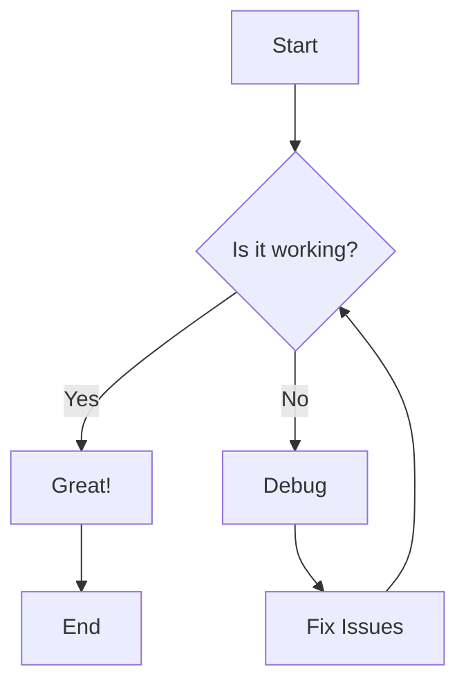

## Sequence Diagram

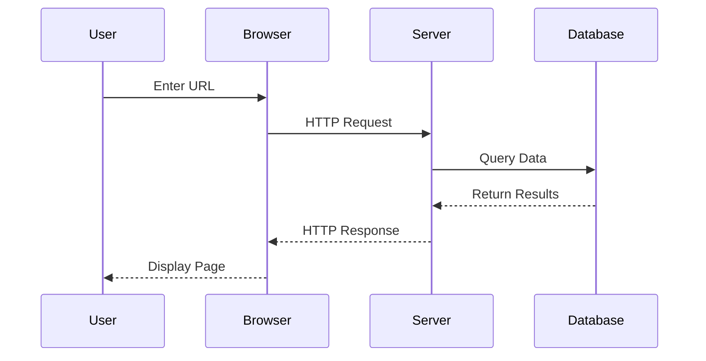

## Class Diagram

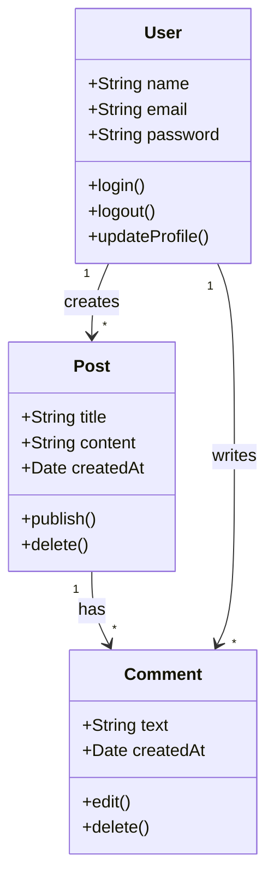

## State Diagram

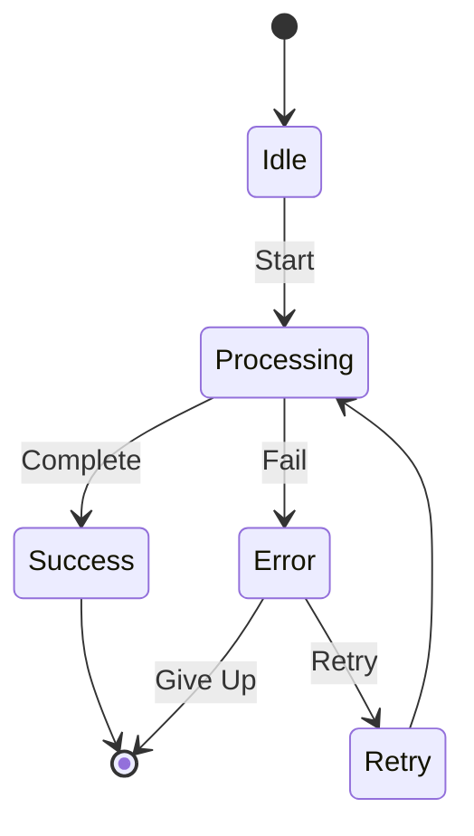

## Entity Relationship Diagram

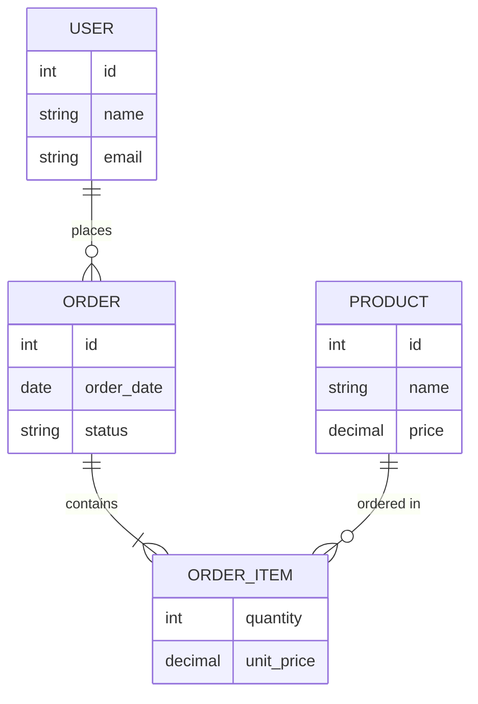

## Gantt Chart

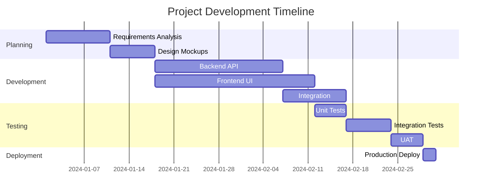

## Pie Chart

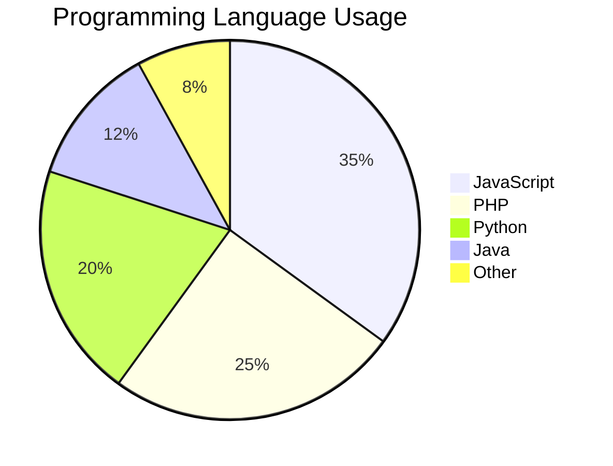

## Git Graph

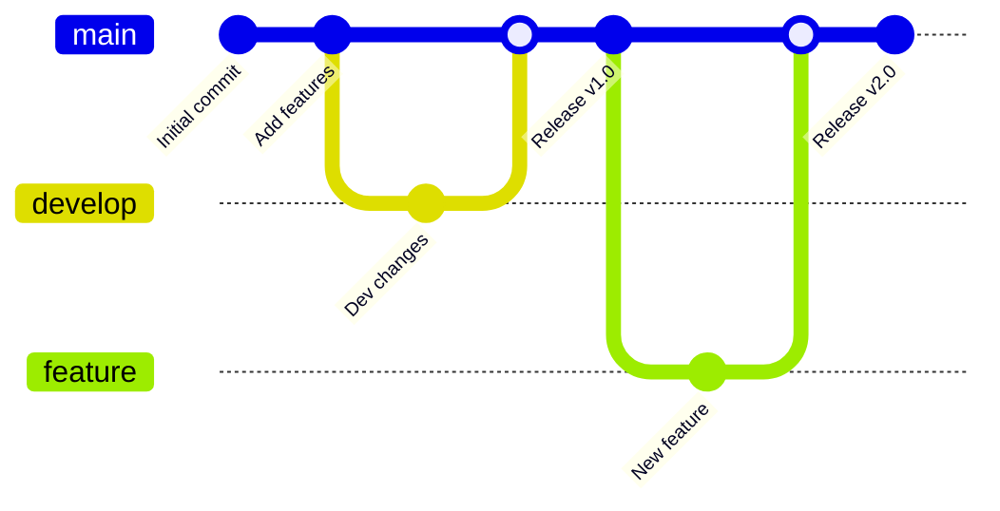

## User Journey

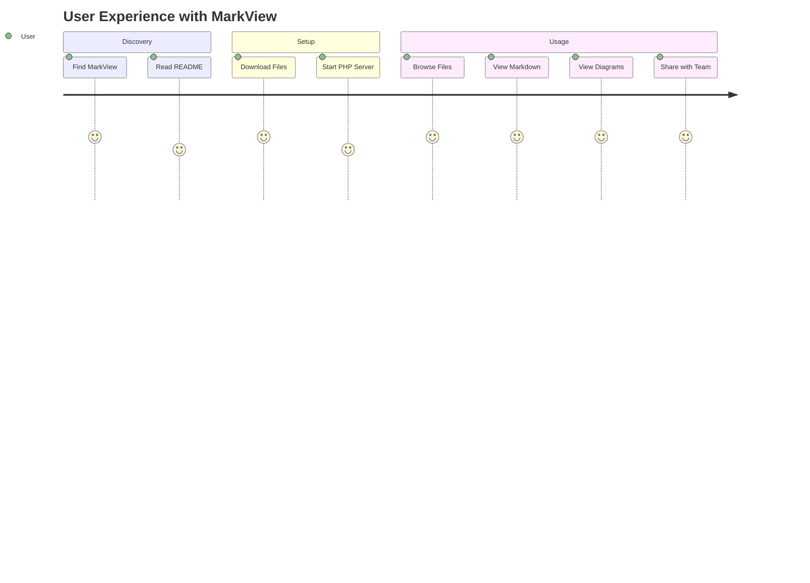

## Mindmap

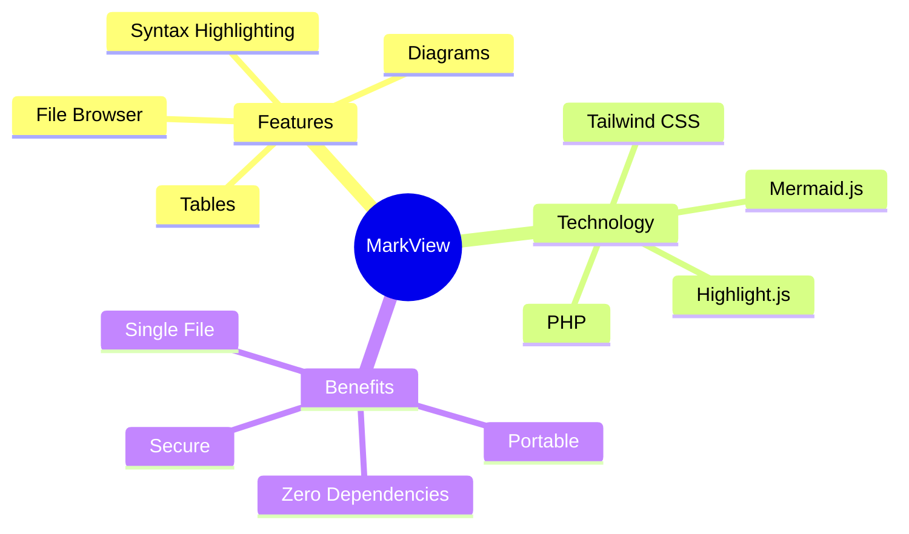

## Timeline

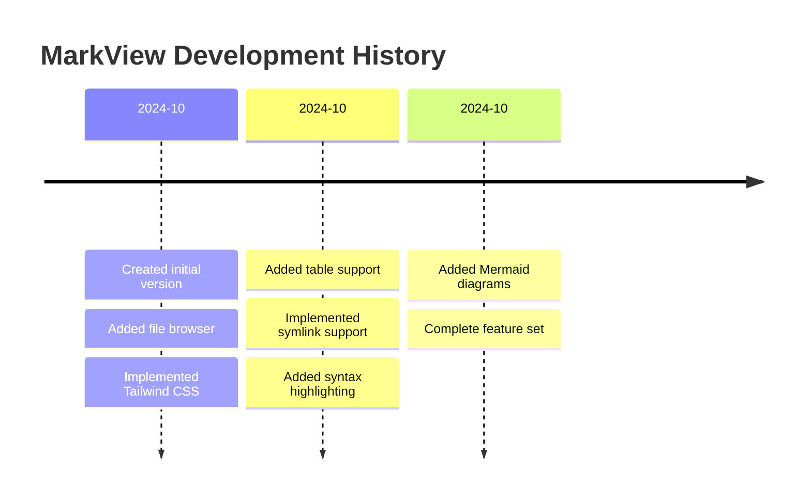

## How to Use

Simply create a code block with `mermaid` as the language:

\`\`\`mermaid
graph LR
    A[Your] --> B[Diagram]
    B --> C[Here]
\`\`\`

[Back to README](README.md) | [See Code Examples](code-examples.md)
