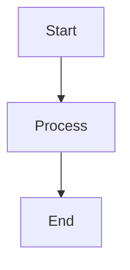
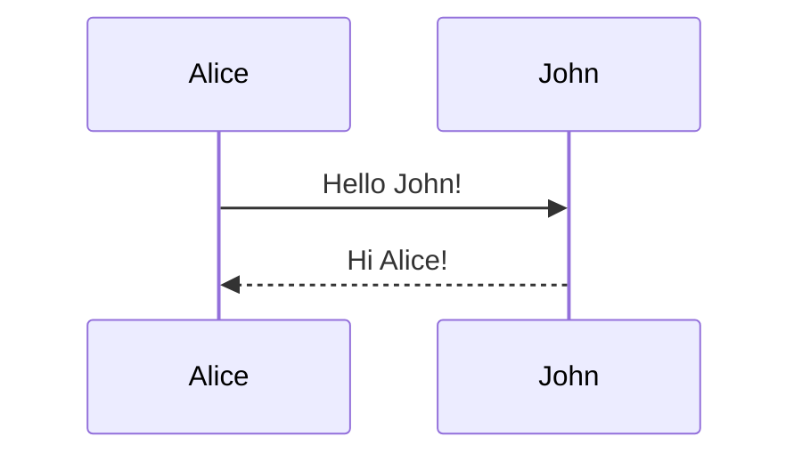

# Simple Diagram Test

## Basic Flowchart

```mermaid
graph TD
    A[Start] --> B[Process]
    B --> C[End]
```

## Simple Sequence

```mermaid
sequenceDiagram
    Alice->>John: Hello John!
    John-->>Alice: Hi Alice!
```

That's it! If you see the diagrams above, it's working!

[Back to README](README.md)
